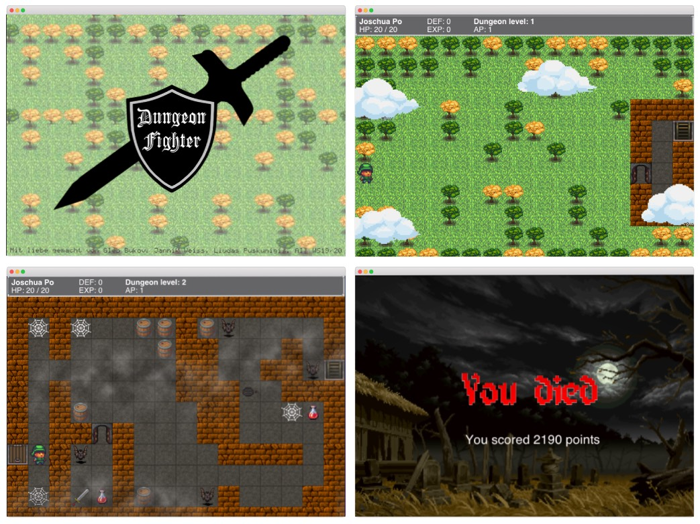

  

# Simple java game

Hello! I'm glad to introduce you my final project at *Objektorientierte Softwareentwicklung*. It is a very small game with java. I did my best to involve all the techniques, i've learned technologies I've learned during this course.

**Functionality:**

+ Randomly generated levels
+ Sounds
+ Equipment (weapons and armor)
+ Simple AI for enemies
+ Boss at the end
+ Fog

--  
**Gleb Bukov**  
HSRM WS2020